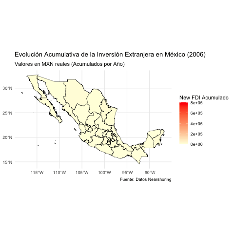

```{r setup, include=FALSE}
knitr::opts_chunk$set(warning = FALSE, message = FALSE)
```

```{r Banner-portada, echo=FALSE, fig.cap="<small>Foto FOREIGN AFFAIRS LATINOAMÉRICA</small>", out.width='100%'}
knitr::include_graphics("Imagenes/Nearshoring-en-Mexico.jpg")
```


## Introducción
#### ¿Qué es el nearshoring? ¿Cómo es la relación entre analítica predictiva y nearshoring?
  
El nearshoring es una estrategia de reubicación de procesos de producción o servicios a países cercanos al mercado objetivo, con el fin de reducir costos logísticos, aprovechar tratados comerciales y mejorar tiempos de entrega. La analítica predictiva juega un papel clave en el nearshoring, ya que permite anticipar tendencias económicas, evaluar riesgos geopolíticos y optimizar la selección de ubicaciones mediante modelos de predicción de costos y demanda.
<br> 

#### Brevemente describir ¿Cuál es el contexto actual del nearshoring para el caso de México?

México se ha hecho una pieza clave para el nearshoring, principalmente por la guerra comercial entre EE.UU. y China al igual que su cercanía con EE.UU. Empresas del sector manufacturero, automotriz, tecnología y logística están trasladando operaciones a México para reducir costos y tiempos de entrega. Sin embargo, el país enfrenta desafíos como infraestructura, costos energéticos y seguridad.
<br> 

#### ¿Cuáles variables tomarías en cuenta para describir / medir el fenómeno del nearshoring para el caso de México? ¿Por qué hacer dicha selección de variable(s)?
   
Flujo de Inversión Extranjera Directa (IED) en sectores afectados por el nearshoring. Número de nuevas plantas industriales y expansiones en zonas estratégicas. Costo logístico y tiempos de entrega en comparación con otros países. Exportaciones manufactureras hacia EE.UU. Disponibilidad de mano de obra calificada y sueldos en sectores clave.  
<br> 

#### Brevemente describir ¿Cuáles son las principales 5 características de un análisis de regresión de datos panel (longitudinal analysis)
  
Observaciones repetidas, Mayor capacidad explicativa, Control de heterogeneidad no observada, Estructura bidimensional, Modelos específicos.
<br> 

#### Brevemente describir ¿Cuáles son las principales 3 diferencias entre un análisis de regresión de datos panel y un análisis de regresión de datos de corte transversal (cross sectional data)?  
  
* Dimensión temporal: El análisis de corte transversal mide un solo punto en el tiempo, mientras que el panel examina múltiples periodos. 
  
* Control de heterogeneidad: El panel maneja variabilidad individual a lo largo del tiempo, el corte transversal no. 
  
* Mayor precisión en inferencias: El panel reduce sesgos en la estimación de efectos causales.
<br>

#### Brevemente describir ¿Cuáles son las principales 3 diferencias entre un análisis de regresión de datos panel y un análisis de regresión de datos de series de tiempo (time series data)?  
  
* Múltiples unidades vs. una sola: El panel analiza varias unidades en distintos periodos, mientras que la serie de tiempo estudia una sola unidad a lo largo del tiempo.   
    
* Estructura de dependencia: En series de tiempo, la dependencia temporal es crucial, mientras que en datos panel hay interdependencia entre unidades y tiempo.   
  
* Métodos de modelado: Las series de tiempo requieren técnicas como ARIMA o cointegración, mientras que el panel usa modelos de efectos fijos y aleatorios.  
  
  
## Librerias

```{r Librerias, message=FALSE, warning=FALSE}
# Manipulación y Transformación de Datos
library(dplyr)       # Manipulación y transformación de datos (filter, mutate, group_by, summarise)
library(tidyr)       # Organización y estructuración de datos en formato "tidy" (spread, gather, pivot_longer, pivot_wider)
library(purrr)       # Programación funcional y manejo de listas
library(janitor)     # Limpieza y formateo de datos (clean_names, remove_empty)

# Importación y Lectura de Archivos
library(readr)       # Lectura rápida de archivos de texto (CSV, TSV, etc.)
library(readxl)      # Importación de archivos Excel

# Visualización de Datos y Gráficos
library(ggplot2)     # Creación de gráficos avanzados y personalizables
library(reshape2)    # Transformación de datos en diferentes estructuras para visualización
library(corrplot)    # Visualización de matrices de correlación
library(rpart.plot)  # Visualización de árboles de decisión

# Modelado y Análisis Estadístico
library(rpart)       # Modelos de árboles de decisión para clasificación y regresión
library(plm)         # Manejo de datos en formato de panel para modelos econométricos

# Manipulación de Cadenas de Texto
library(stringr)     # Manipulación de cadenas de texto (regex, detección de patrones, etc.)
library(stringi)     # Procesamiento avanzado de cadenas (Unicode, conteo de caracteres, etc.)

# Manejo de Fechas y Tiempos
library(lubridate)   # Manipulación de fechas y tiempos en R

# Generación de Informes y Tablas en R Markdown
library(knitr)       # Creación de documentos dinámicos en R Markdown
library(kableExtra)  # Mejora del formato y estilo de las tablas generadas con knitr::kable

# Geoespacial y Mapas
library(sf)          # Análisis y manipulación de datos espaciales en formato "Simple Features"
library(rnaturalearth)        # Obtención de mapas geoespaciales de todo el mundo
library(rnaturalearthdata)    # Conjunto de datos espaciales adicionales para mapas

# Animaciones y Visualización Dinámica
library(gganimate)   # Creación de animaciones en gráficos de R
library(transformr)  # Transiciones suaves en animaciones con gganimate
```

## Dataset

#### Glosario:
* **new_fdi:**	New Foreign Direct Investment Inflows. Millions of Dollars.  
* **reinv_profits:**	Reinvestment of Profits - Foreign Direct Investment Inflows. Millions of Dollars.  
* **intercom_acc:**	Intercompany Accounts - Foreign Direct Investment Inflows. Millions of Dollars.  
* **total_fdi:**	Total Foreign Direct Investment Inflows. Millions of Dollars.  
* **crime_rate:**	Crime rate per 100,000 state's population.  
* **unemployment:**	Percentaje of unemployed population.  
* **employment:** 	Percentaje of employed population.  
* **business_activity:**	Index of economic activity weighted by the state's distance to nearest U.S. port of entry.  
* **real_wage:**	Real wage using 2018 INPC = 100. MXN Pesos. 
* **pop_density:**	Population per state's land area km2.  
* **good_governance:**	Ratio between state's public investment and its public debt.  
* **ratio_public_investment:**	Ratio between state's public investment and its gross domestic product (GDP).  
* **lq_primary:**	Location quotient of employed people in primary industry.  
* **lq_secondary:**	Location quotient of employed people in secondary sector.  
* **lq_tertiary	Location:** quotient of employed people in tertiary sector.  
* **exchange_rate:**	MXN pesos per 1 USD  
* **patents_rate:**	Number of R&D patentes per 100,000 state's population  
* **inpc:**	National Price Consumer Index. 2018 = 100  


```{r Dataset, echo=FALSE, message=FALSE, warning=FALSE}
# Read the Excel file
nearshoring <- read_excel('panel_data.xlsx')

# Renombrar columnas
nearshoring <- nearshoring %>%
  rename(region_name = `region...23`, 
         region_num = `region...24`)

# Convert to a panel data frame with 'state' as the cross-section and 'year' as the time variable
#nearshoring <- pdata.frame(nearshoring, index = c("state", "year"))

# Verificar los cambios
colnames(nearshoring)
```

## Overview and Adjustments

#### Transformación de Variables
b. Crear y/o transformar variables (e.g., variables nominales, variables reales, variables ponderadas, etc.)

```{r Modifications, message=FALSE, warning=FALSE}
# Convertir valores de USD a MXN
nearshoring <- nearshoring %>%
  mutate(across(c(new_fdi, reinv_profits, intercom_acc, total_fdi, exports_miles_dlls), 

                ~ . * exchange_rate, .names = "mxn_{.col}"))

# Ajustar valores a precios reales (2018)
nearshoring <- nearshoring %>%
  mutate(across(c(mxn_new_fdi, mxn_reinv_profits, mxn_intercom_acc, mxn_total_fdi, real_wage, mxn_exports_miles_dlls), 
                ~ . / inpc * 100, .names = "real_{.col}"))

# Convertir region_name a factor para evitar problemas con ggplot2
nearshoring <- nearshoring %>%
  mutate(region_name = as.factor(region_name))

# Subset solo con variables reales en MXN (sin dólares)
nearshoring_clean <- nearshoring %>%
  select(state, year, region_name, region_num, 
         real_mxn_new_fdi, real_mxn_reinv_profits, real_mxn_intercom_acc, 
         real_mxn_total_fdi, real_wage, real_mxn_exports_miles_dlls, 
         crime_rate, unemployment, employment, business_activity, 
         pop_density, good_governance, ratio_public_investment, 
         lq_primary, lq_secondary, lq_tertiary, patents_rate, 
         exchange_rate, inpc, border_distance, trump_election)

# Visualizar primeras filas
head(nearshoring_clean)
```

#### Comportamiento de Variables
```{r}
summary(nearshoring_clean)
```

#### Matriz de Correlación
```{r}
nearshoring_numeric <- nearshoring_clean[, !names(nearshoring_clean) %in% c("real_wage", "total_fdi","intercom_acc","reinv_profits","new_fdi","total_fdi", "mxn_total_fdi","mxn_intercom_acc","mxn_reinv_profit","mxn_new_fdi")]

nearshoring_numeric <- nearshoring_numeric[, sapply(nearshoring_numeric, is.numeric)]

cor_matrix <- cor(nearshoring_numeric, use = "complete.obs")

cor_long <- melt(cor_matrix)


ggplot(cor_long, aes(Var1, Var2, fill = value)) +
  geom_tile() +
  scale_fill_gradient2(low = "blue", high = "red", mid = "white", 
                       midpoint = 0, limit = c(-1,1), space = "Lab",
                       name="Correlación") +
  theme_minimal() +
  theme(axis.text.x = element_text(angle = 45, vjust = 1, hjust=1)) +
  labs(title = "Correlation Matrix of Numeric Variables", x = "", y ="")

```

## Analisis Exploratorio

### Estadísticos Descriptivos y de Dispersión

#### Estadísticas Generales  

```{r Estadisticas Generales, echo=FALSE}
# Vector con las variables específicas
variables_interes <- c("pop_density","employment","crime_rate", "business_activity", "border_distance","lq_primary","lq_secondary","lq_tertiary")

# Selecciona las variables específicas y calcula las estadísticas
df_summary <- data.frame(
  #Variable = variables_interes,
  media   = sapply(nearshoring_clean[variables_interes], mean, na.rm = TRUE),
  mínimo  = sapply(nearshoring_clean[variables_interes], min, na.rm = TRUE),
  Q1      = sapply(nearshoring_clean[variables_interes], quantile, 0.25, na.rm = TRUE),
  mediana = sapply(nearshoring_clean[variables_interes], median, na.rm = TRUE),
  Q3      = sapply(nearshoring_clean[variables_interes], quantile, 0.75, na.rm = TRUE),
  máximo  = sapply(nearshoring_clean[variables_interes], max, na.rm = TRUE),
  std     = sapply(nearshoring_clean[variables_interes], sd, na.rm = TRUE)
) %>%
  mutate(across(where(is.numeric), ~ formatC(.,
                                               format = "f",
                                               big.mark = ",",
                                               digits = 2)))

# Genera la tabla en R Markdown
df_summary %>%
  kable(format = "html", caption = "Estadísticas descriptivas por variable") %>%
  kable_styling(bootstrap_options = c("striped", "hover", "condensed"), full_width = FALSE)
```


* La **densidad de población** a lo largo de los estados y los años es muy dispersa, **cada entidad tiene características propias y distintas**, lo que puede ser importante al momento de realizar una inversión.  
   
* La **tasa de empleo** es encuentra muy concentrada en valores entre **0.95 - 0.98**, al tener poca dispersión siendo medida de manera general y nos puede llegar a indicar que todos **los estados se comportan de manera similar** a lo largo del tiempo.       
     
* La **distancia al borde fronterizo** cuenta con cierto **sesgo a la derecha**, comportamiento natural considerando que cada vez que nos alejemos de linea fronteriza habrá menos cantidad de entidades, sin embargo aquellos estados con más cercanía pudieran verse beneficiados.   
  
#### Nueva Inversión Extranjera

##### Comportamiento por Region
```{r N-FDI Region, echo=FALSE}
# Generación de estadísticas por Región
df_summary <- nearshoring_clean %>%
  group_by(region_name) %>%
  summarise(
    media   = mean(real_mxn_new_fdi, na.rm = TRUE),
    mínimo  = min(real_mxn_new_fdi, na.rm = TRUE),
    Q1      = quantile(real_mxn_new_fdi, 0.25, na.rm = TRUE),
    mediana = median(real_mxn_new_fdi, na.rm = TRUE),
    Q3      = quantile(real_mxn_new_fdi, 0.75, na.rm = TRUE),
    máximo  = max(real_mxn_new_fdi, na.rm = TRUE),
    std     = sd(real_mxn_new_fdi, na.rm = TRUE)
  )%>%
  mutate(across(where(is.numeric), ~ formatC(.,
                                               format = "f",
                                               big.mark = ",",
                                               digits = 2)))

# Visualización de Estadísticas
df_summary %>%
  kable(format = "html", caption = "Comportamiento de la <b>Nueva Inversión Extranjera</b> por región") %>%
  kable_styling(bootstrap_options = c("striped", "hover", "condensed"), full_width = FALSE)
```
  
##### Comportamiento por Entidad
```{r N-FDI Entidad, echo=FALSE}
df_estadisticas <- nearshoring_clean %>%
  filter(region_name %in% c("Bajio", "Centro","Norte"))

# Generación de estadísticas por Región
df_summary <- df_estadisticas %>%
  group_by(region_name,state) %>%
  summarise(
    media   = mean(real_mxn_new_fdi, na.rm = TRUE),
    mínimo  = min(real_mxn_new_fdi, na.rm = TRUE),
    Q1      = quantile(real_mxn_new_fdi, 0.25, na.rm = TRUE),
    mediana = median(real_mxn_new_fdi, na.rm = TRUE),
    Q3      = quantile(real_mxn_new_fdi, 0.75, na.rm = TRUE),
    máximo  = max(real_mxn_new_fdi, na.rm = TRUE),
    std     = sd(real_mxn_new_fdi, na.rm = TRUE)
  )%>%
  ungroup() %>%
  arrange(region_name,state)%>%
  mutate(across(where(is.numeric), ~ formatC(.,
                                               format = "f",
                                               big.mark = ",",
                                               digits = 2)))

# Visualización de Estadísticas
df_summary %>%
  kable(format = "html", caption = "Comportamiento de la <b>Nueva Inversión Extranjera</b> por Entidad") %>%
  kable_styling(bootstrap_options = c("striped", "hover", "condensed"), full_width = FALSE)
```
  
* Las regiones que presentan **mayor atracción** a nuevas inversiones extranjeras son **Norte, Centro y Bajío**.  
  
* La **región Centro** aunque tiene la media de inversiones más alta no se puede considerar la región que recauda mayor inversión, esto debido al sesgo que se encuentra dentro de la región teniendo una **dispersión muy alta** a comparación de las demás y considerando que **el valor máximo es 10 veces el valor del percentil 75**.  
  
* La **región Norte** cuenta con algo de sesgo similar a la región centro solo que en menor medida, al igual esta región cuenta con una **mediana superior** a los demás teniendo **generalmente un tamaño de inversión más alto**.  
  
* Dentro de la región Centro se puede observar que principalmente es la **Ciudad de México**, la entidad donde se **centraliza la inversión**, teniendo también una dispersión muy alta por si misma.  
  
* En la región Norte se encuentra como principal protagonista la entidad de **Nuevo León**, siendo el **segundo estado con mayor inversiones nuevas al nivel federal**. Nuevo León cuenta con una menor dispersión que CDMX indicando que es **más usual ver inversiones similares** dentro del estado.  
  
* Dentro de las regiones, principalmente Centro y Norte, no se puede apreciar homogeneidad en la cantidad ($) de inversiones que encuentran en sus entidades federativas. La **región del Bajío** cuenta con métricas más uniformes a lo largo de los estados, lo cual podría **favorecer un crecimiento constante** a lo largo de la región.  
  

#### Actividad de Negocios

##### Comportamiento por Región
```{r BA Region, echo=FALSE}
# Generación de estadísticas por Región
df_summary <- nearshoring_clean %>%
  group_by(region_name) %>%
  summarise(
    media   = mean(business_activity, na.rm = TRUE),
    mínimo  = min(business_activity, na.rm = TRUE),
    Q1      = quantile(business_activity, 0.25, na.rm = TRUE),
    mediana = median(business_activity, na.rm = TRUE),
    Q3      = quantile(business_activity, 0.75, na.rm = TRUE),
    máximo  = max(business_activity, na.rm = TRUE),
    std     = sd(business_activity, na.rm = TRUE)
  )%>%
  mutate(across(where(is.numeric), ~ formatC(.,
                                               format = "f",
                                               big.mark = ",",
                                               digits = 2)))

# Visualización de Estadísticas
df_summary %>%
  kable(format = "html", caption = "Comportamiento de la <b>Actividad de Negocio</b> por región") %>%
  kable_styling(bootstrap_options = c("striped", "hover", "condensed"), full_width = FALSE)
```

##### Comportamiento por Entidad
```{r BA Entidad, echo=FALSE, message=FALSE, warning=FALSE}
df_estadisticas <- nearshoring_clean %>%
  filter(region_name %in% c("Bajio", "Centro","Norte"))

# Generación de estadísticas por Región
df_summary <- df_estadisticas %>%
  group_by(region_name,state) %>%
  summarise(
    media   = mean(business_activity, na.rm = TRUE),
    mínimo  = min(business_activity, na.rm = TRUE),
    Q1      = quantile(business_activity, 0.25, na.rm = TRUE),
    mediana = median(business_activity, na.rm = TRUE),
    Q3      = quantile(business_activity, 0.75, na.rm = TRUE),
    máximo  = max(business_activity, na.rm = TRUE),
    std     = sd(business_activity, na.rm = TRUE)
  )%>%
  ungroup() %>%
  arrange(region_name,state)%>%
  mutate(across(where(is.numeric), ~ formatC(.,
                                               format = "f",
                                               big.mark = ",",
                                               digits = 2)))

# Visualización de Estadísticas
df_summary %>%
  kable(format = "html", caption = "Comportamiento de la <b>Actividad de Negocio</b> por Entidad") %>%
  kable_styling(bootstrap_options = c("striped", "hover", "condensed"), full_width = FALSE)
```

* Tanto la mediana como la media **tienden a ubicarse en valores negativos**. Esto indica que, en la mayoría de los estados, la **Actividad de negocio** está por debajo de un punto de referencia, representando un **entorno empresarial menos dinámico**.  
  
* Existe una dispersión considerable a nivel nacional, esto se debe a la dispersión que existe **principalmente en la región Norte** donde se encuentra y por diferencia el estado que **ha mantenido una Actividad de negocio alta a lo largo de los años**, Baja California.


## Visualización de los Datos

### Análisis Univariado

##### Histograma para Variables Numericas
```{r}
# Filtrar solo las columnas numéricas y eliminar 'year' y 'trump_election'
nearshoring_numeric <- nearshoring_clean %>%
  select(where(is.numeric)) %>%
  select(-year, -trump_election, -region_num)

# Convertir a formato largo
nearshoring_numeric_long <- nearshoring_numeric %>%
  pivot_longer(cols = everything(), names_to = "Variable", values_to = "Valor")

# Obtener lista de variables en grupos de 4
variables <- unique(nearshoring_numeric_long$Variable)
num_groups <- ceiling(length(variables) / 4)  # Número de grupos de 4

# Generar histogramas en grupos de 4
for (i in seq(1, length(variables), by = 4)) {
  vars_subset <- variables[i:min(i+3, length(variables))]  # Seleccionar grupo de 4 variables
  
  plot <- ggplot(nearshoring_numeric_long %>% filter(Variable %in% vars_subset), aes(x = Valor)) +
    geom_histogram(bins = 30, fill = "steelblue", color = "black", alpha = 0.7) +
    facet_wrap(~Variable, scales = "free", ncol = 2) +  # Agrupar en 2 columnas
    theme_minimal() +
    labs(title = paste("Distribución de Variables"),
         x = "Valor",
         y = "Frecuencia") +
    theme(strip.text = element_text(face = "bold", size = 12),
          plot.title = element_text(hjust = 0.5, face = "bold", size = 14))
  
  print(plot)  # Mostrar gráfico
}
```

- La mayoría de las variables presentan **sesgo a la derecha**, indicando que hay pocos valores extremadamente altos y muchos valores bajos, lo que sugiere la necesidad de **transformaciones como exponente o logaritmo** para mejorar la linealidad en los modelos.

- Los coeficientes de localización sectorial (*LQ primary, LQ secondary, LQ tertiary*) tienen distribuciones más cercanas a normales, aunque *LQ secondary* presenta **bimodalidad**, lo que podría reflejar la presencia de dos tipos de regiones con dinámicas industriales diferentes.

- Algunas variables, como *patents_rate*, muestran **distribuciones con múltiples picos o poca variabilidad**, lo que puede afectar su capacidad predictiva en modelos de regresión si no se maneja adecuadamente.

##### Variables Numericas contra Nueva Inversión
```{r}
# Quitamos exports porque sus datos opacan los de más gráficos
nearshoring2 <- nearshoring_clean %>%
  select(-real_mxn_exports_miles_dlls) %>%
  select(where(is.numeric)) %>% 
  select(matches("real_mxn"))

# Transformar los datos a formato largo para ggplot
nearshoring_largo <- nearshoring2 %>%
  pivot_longer(cols = everything(), names_to = "Variable", values_to = "Valor")

# Crear boxplots sin outliers con diferentes colores por variable
ggplot(nearshoring_largo, aes(x = Variable, y = Valor, fill = Variable)) +
  geom_boxplot(outliers = FALSE,color = "black") +  
  theme_minimal() +
  theme(axis.text.x = element_text(angle = 45, hjust = 1)) +
  labs(title = "Boxplots de variables numéricas en nearshoring (sin outliers)", 
       x = "Variable", 
       y = "Valor") +
  scale_fill_brewer(palette = "Set3")
```

- La variable **real_mxn_intercom_acc** presenta una gran cantidad de valores cercanos a cero, lo que indica que la mayoría de las entidades tienen bajos niveles de esta métrica, con **algunas excepciones que presentan valores significativamente más altos**.

- **real_mxn_new_fdi** muestra un comportamiento similar con una mediana baja y un rango intercuartil pequeño, lo que sugiere que la mayoría de las inversiones nuevas son relativamente pequeñas en comparación con algunos valores atípicos que pueden corresponder a **entidades que han recibido inversiones extranjeras significativamente mayores**.

- La variable **real_mxn_reinv_profits** tiene una dispersión ligeramente menor, lo que indica que **las ganancias reinvertidas muestran una menor variabilidad** entre las entidades en comparación con las inversiones nuevas.

- **real_mxn_total_fdi** tiene la mayor dispersión entre todas las variables y muestra **una gran cantidad de valores atípicos**, lo que sugiere que **algunas entidades reciben montos muy altos de inversión extranjera directa en comparación con el resto**. Esto podría indicar una **desigual distribución de la inversión** en el país.

##### Salarios por Region contra Nueva Inversión
```{r}
# Crear boxplots con colores por región
ggplot(nearshoring_clean, aes(x = real_wage, y = real_mxn_new_fdi, fill = region_name)) +
  geom_boxplot(color = "black") +  
  theme_minimal() +
  theme(axis.text.x = element_text(angle = 45, hjust = 1)) +
  labs(title = "Boxplots de salario en nearshoring por región", 
       x = "Variable", 
       y = "Valor", 
       fill = "Región") +
  ylim(200, 550) +
  scale_fill_brewer(palette = "Set3")  # Paleta de colores para diferenciar regiones
```

- Se observa que **las regiones tienen distribuciones diferenciadas en las variables analizadas**, lo que sugiere que el impacto del nearshoring puede variar significativamente según la zona geográfica.

- La **región Norte** presenta valores consistentemente más altos en comparación con otras regiones, lo que indica que esta zona podría estar capturando una mayor proporción de la actividad económica relacionada con el nearshoring.

- La **región Centro** muestra una mayor dispersión en los valores, lo que sugiere que hay estados con niveles muy variados de inversión y actividad, probablemente debido a la presencia de estados con dinámicas económicas distintas dentro de la misma región.

- La **región Bajío** también presenta valores elevados, aunque con una dispersión más controlada, lo que podría indicar que esta zona tiene una distribución más homogénea de los beneficios del nearshoring.

- La **región Sur** tiende a mostrar valores más bajos en comparación con las demás regiones, lo que sugiere que esta zona podría estar menos integrada en las estrategias de nearshoring o enfrentando más barreras para atraer inversiones.

- La **región Occidente** muestra una distribución intermedia, con valores que no alcanzan los niveles del Norte o Bajío, pero que tampoco presentan la baja dispersión del Sur.

Estos patrones pueden ser clave para diseñar estrategias de inversión diferenciadas según la región.

##### Tipos de Inversión Extranjera por Entidad
```{r}
# Lista de variables a analizar
variables_real_mxn <- c("real_mxn_intercom_acc", "real_mxn_new_fdi", "real_mxn_reinv_profits", "real_mxn_total_fdi")

nearshoring3 <- nearshoring %>%
  rename(
    "cuentas intercompañia FDI" = real_mxn_intercom_acc,
    "Nueva inversion extranjera directa" = real_mxn_new_fdi,
    "reinversión de las ganancias" = real_mxn_reinv_profits,
    "Inversion extranjera directa total" = real_mxn_total_fdi
  )
# Función para generar barplot de los 10 estados con valores más altos
crear_barplot <- function(var_name) {
  # Agrupar por estado y calcular el promedio de la variable
  datos_top <- nearshoring3 %>%
    group_by(state) %>%
    summarise(Valor_Promedio = mean(.data[[var_name]], na.rm = TRUE)) %>%
    top_n(10, Valor_Promedio) %>%
    arrange(desc(Valor_Promedio)) %>%
    mutate(state_id = as.factor(state))  # Convertir en factor para evitar error

  # Crear el barplot
  ggplot(datos_top, aes(x = reorder(state, Valor_Promedio), y = Valor_Promedio, fill = state_id)) +
    geom_bar(stat = "identity", color = "black", width = 0.6) +
    theme_minimal() +
    theme(
      axis.text.x = element_text(angle = 45, hjust = 1, size = 12, face = "bold", color = "black"),
      axis.title = element_text(size = 14, face = "bold"),
      plot.title = element_text(size = 18, face = "bold", hjust = 0.5),
      legend.position = "none"
    ) +
    labs(title = paste("Top 10 Estados -", var_name),
         x = "Estado",
         y = "Valor Promedio") +
    coord_flip()
}

# Generar los 4 gráficos
barplot_intercom_acc <- crear_barplot("cuentas intercompañia FDI")
barplot_new_fdi <- crear_barplot("Nueva inversion extranjera directa")
barplot_reinv_profits <- crear_barplot("reinversión de las ganancias")
barplot_total_fdi <- crear_barplot("Inversion extranjera directa total")

# Mostrar los gráficos individualmente
print(barplot_intercom_acc)
print(barplot_new_fdi)
print(barplot_reinv_profits)
print(barplot_total_fdi)
```

- **Chihuahua, Ciudad de México y Baja California** lideran en cuentas intercompañía de FDI, lo que sugiere que estas entidades tienen un fuerte ecosistema empresarial con múltiples filiales y conexiones globales.

- En términos de **nueva inversión extranjera directa**, **Ciudad de México es el principal receptor**, con un monto significativamente superior al de otros estados, lo que reafirma su papel como el centro económico y financiero más importante del país.

- **Nuevo León, Estado de México y Jalisco** también reciben altos niveles de nueva inversión extranjera, consolidándose como hubs industriales clave en el país.

- **La reinversión de ganancias sigue una tendencia similar**, con Ciudad de México nuevamente a la cabeza, lo que sugiere que las empresas ya establecidas en la capital están reinvirtiendo más capital en comparación con otros estados.

- **Nuevo León, Jalisco y Guanajuato** también presentan altos niveles de reinversión, lo que refleja la confianza de las empresas en estas entidades como destinos estratégicos para mantener operaciones.

- En la **Inversión Extranjera Directa Total**, Ciudad de México domina nuevamente el ranking, superando por un amplio margen a los demás estados, seguida por **Nuevo León, Estado de México y Jalisco**.

- **Chihuahua y Baja California** se destacan dentro de la región norte, lo que puede estar relacionado con su proximidad a la frontera con EE.UU. y su participación en la industria manufacturera.

- **Querétaro, Guanajuato y Coahuila** aparecen recurrentemente en las listas, consolidándose como estados clave en el nearshoring y en la atracción de inversiones en manufactura y tecnología.

Estos patrones reflejan cómo la inversión extranjera se concentra en ciertas entidades con ventajas estratégicas, como acceso a mercados globales, infraestructura industrial y estabilidad económica.

### Análisis Bivariado

##### Distribución Regional de la Inversión Extranjera Directa en México
```{r}
# Calcular porcentaje de datos por región
nearshoring_summary <- nearshoring_clean %>%
  group_by(region_name) %>%
  summarise(count = n()) %>%
  mutate(percentage = (count / sum(count)) * 100)

# Crear el boxplot con etiquetas de porcentaje
ggplot(nearshoring_clean, aes(x = region_name, y = real_mxn_new_fdi, fill = region_name)) +
  geom_boxplot(color = "black") +  # Color de borde negro
  theme_minimal() +
  labs(title = "Distribución de la Nueva Inversión Extranjera por Región",
       x = "Región", y = "Nueva Inversión Extranjera (MXN reales)") +
  theme(axis.text.x = element_text(angle = 45, hjust = 1)) +
  scale_fill_brewer(palette = "Set2") +  # Paleta de colores más visualmente agradable
  geom_text(data = nearshoring_summary, aes(x = region_name, y = max(nearshoring_clean$real_mxn_new_fdi, na.rm = TRUE) * 1.05, label = paste0(round(percentage, 1), "%")), size = 4, fontface = "bold", vjust = 0, color = "black")  # Ajuste para que el texto esté arriba
```

- **Las regiones Sur (25%) y Occidente (21.9%) tienen la mayor cantidad de datos en la muestra, pero con inversiones bajas y comprimidas**.  
  - Aunque estas regiones representan la mayor cantidad de observaciones en los datos, **sus valores de inversión extranjera directa están fuertemente concentrados en montos bajos**.  
  - Esto sugiere que **el Sur y Occidente no son destinos estratégicos para el nearshoring**, ya que no están atrayendo inversiones de gran magnitud.  
  - **Posibles razones** incluyen menor infraestructura industrial, mayor distancia con EE.UU., menos desarrollo en sectores manufactureros y posibles barreras logísticas o regulatorias.

- **El Centro (18.8%) y el Norte (18.8%) tienen menos datos en la muestra, pero con inversiones más dispersas y de mayor magnitud**.  
  - **El Centro muestra una gran dispersión en la inversión**, lo que indica que algunas entidades, como la Ciudad de México y otros polos industriales, reciben inversiones significativamente mayores.  
  - **El Norte también presenta una mayor variabilidad en la inversión**, lo que sugiere que esta región sigue siendo un destino clave para nearshoring, con estados que captan proyectos estratégicos de manufactura y logística.

- **El Bajío (15.6%) tiene la menor cantidad de datos, pero su inversión es más estable y homogénea**.  
  - Aunque representa una menor proporción de la muestra, **la inversión extranjera en el Bajío muestra menor dispersión y valores más consistentes**, lo que indica una captación de nearshoring más estructurada y constante.  
  - Esto es consistente con la especialización de la región en **sectores como automotriz y aeroespacial**, que han sido pilares clave del nearshoring en México.


##### Relación entre Inversión Extranjera y Densidad Poblacional
```{r}
# Scatter plot entre real_mxn_new_fdi y pop_density con color de puntos según valor de lq_tertiary
ggplot(nearshoring_clean, aes(x = pop_density, y = sqrt(real_mxn_new_fdi), color = lq_tertiary)) +
  geom_point(alpha = 0.7) +
  scale_x_log10() +  # Escala logarítmica para densidad poblacional
  scale_color_gradient(low = "blue", high = "red") +
  theme_minimal() +
  labs(title = "Relación entre Raíz Cuadrada de Nueva Inversión Extranjera y Densidad Poblacional",
       x = "Densidad Poblacional (Escala Log)", 
       y = "Raíz Cuadrada de Nueva Inversión Extranjera (MXN reales)",
       color = "LQ Sector Terciario")
```

- **Las ciudades más densamente pobladas concentran mayores inversiones**, aunque la densidad por sí sola no parece ser un factor determinante.  

- **El sector terciario juega un papel clave**: los estados con altos montos y alta densidad parecen tener altos niveles de especialización en servicios (LQ > 1.2) en común.  

- **Las áreas con baja densidad y menor desarrollo en servicios tienen dificultades para atraer inversión**, sugiriendo que otros factores como infraestructura e incentivos fiscales pueden ser más relevantes.  

##### Relación entre Inversión Extranjera y LQ del Sector Primario
```{r}
ggplot(nearshoring_clean, aes(x = lq_primary, y = sqrt(real_mxn_new_fdi), color = employment)) +
  geom_point(alpha = 0.7) +
  scale_x_log10() +  # Escala logarítmica en el eje X
  scale_y_log10() +  # Escala logarítmica en el eje Y
  scale_color_gradient(low = "blue", high = "red") +  # Mapea el color según employment
  theme_minimal() +
  labs(title = "Relación entre Nueva Inversión Extranjera y LQ del Sector Primario",
       x = "LQ Sector Primario (Escala Log)", 
       y = "Raiz de Nueva Inversión Extranjera (MXN reales, Escala Log)",
       color = "Employment Rate")
```

- **Las regiones con alta especialización en el sector primario (LQ > 1) tienden a recibir menos inversión extranjera**, lo que sugiere que este sector no es un motor clave para atraer capital externo.  

- **Los valores más altos de inversión están concentrados en zonas con menor presencia del sector primario**, indicando que las inversiones se dirigen a economías más diversificadas o con mayor industrialización.  

- **El empleo general es alto en casi todas las observaciones**, pero no parece estar relacionado con la inversión ni con la especialización en el sector primario, lo cual es congruente con el analisis de estadisticos descriptivo  

##### Relación entre Inversión Extranjera y Tasa de Patentes
```{r}
# Scatter plot entre real_mxn_new_fdi y patents_rate
ggplot(nearshoring_clean, aes(x = patents_rate, y = sqrt(real_mxn_new_fdi))) +
  geom_point(alpha = 0.7, color = "purple") +
  #scale_y_log10() +  
  scale_x_log10() + # Escala logarítmica en el eje X (tasa de patentes)
  theme_minimal() +
  labs(title = "Relación entre Raíz Cuadrada de Nueva Inversión Extranjera y Tasa de Patentes",
       x = "Tasa de Patentes (Escala Log)", 
       y = "Raíz Cuadrada de Nueva Inversión Extranjera (MXN reales)")
```

- **No hay una relación lineal tan marcada entre la tasa de patentes y la inversión extranjera**, lo que sugiere que la innovación no es el principal factor para atraer capital.  

- **Las inversiones altas se observan tanto en regiones con pocas como con muchas patentes**, aunque cabe mencionar que parecen ser más frecuentes en valores altos de tasa de patente.  

- **Las regiones con mayor innovación pueden captar inversión, pero no de manera sistemática**, lo que sugiere que la investigación y el desarrollo deben ir acompañados de otras condiciones para atraer capital extranjero.  

##### Intensidad de Inversión Extranjera por Estado Acumulada a través de los Años
```{r}
# Obtener el mapa de México con divisiones por estado
mexico_map <- ne_states(country = "Mexico", returnclass = "sf")

# Normalizar nombres: convertir a minúsculas, eliminar acentos, y renombrar Distrito Federal a Ciudad de Mexico
mexico_map$name <- mexico_map$name %>%
  tolower() %>%
  stri_trans_general("Latin-ASCII") %>%
  str_replace_all("distrito federal", "ciudad de mexico")  # Cambiar Distrito Federal a Ciudad de Mexico

# Asegurar que year sea numérico y calcular inversión acumulativa
nearshoring_clean_df <- nearshoring_clean %>%
  as.data.frame() %>%
  mutate(state = tolower(state) %>% 
           stri_trans_general("Latin-ASCII") %>%
           str_replace_all("ciudad de mexico", "ciudad de mexico"),  # Asegurar consistencia en el nombre
         year = as.numeric(as.character(year))) %>%
  group_by(state, year) %>%
  summarise(real_mxn_new_fdi = sum(real_mxn_new_fdi, na.rm = TRUE), .groups = "drop") %>%
  arrange(state, year) %>%
  group_by(state) %>%
  mutate(cumulative_fdi = cumsum(real_mxn_new_fdi))  # Crear variable acumulativa

# Unir datos con el mapa
mexico_map <- mexico_map %>%
  left_join(nearshoring_clean_df, by = c("name" = "state"))

# Crear el mapa con animación acumulativa
animated_map <- ggplot(mexico_map) +
  geom_sf(aes(fill = cumulative_fdi), color = "black", size = 0.2) +
  scale_fill_gradient(low = "lightyellow", high = "red", na.value = "gray80") +
  theme_minimal() +
  labs(title = "Evolución Acumulativa de la Inversión Extranjera en México ({closest_state})",
       subtitle = "Valores en MXN reales (Acumulados por Año)",
       fill = "New FDI Acumulado",
       caption = "Fuente: Datos Nearshoring") +
  transition_states(year, transition_length = 2, state_length = 1, wrap = FALSE) +  # Mantiene valores acumulados
  ease_aes('linear')  # Transición lineal entre años

# Guardar el GIF con mayor calidad
# anim_save("mapa_inversion_mexico_acumulado.gif", 
          # animated_map, 
          # renderer = gifski_renderer(loop = TRUE, width = 1200, height = 800),  # Aumentar resolución
          # fps = 10,   # Aumentar cuadros por segundo para mayor fluidez
          # duration = 15)  # Extender la duración para una transición más suave
```

```{r}
# Insertar el GIF en R Markdown (solo en HTML)

```

- **CDMX, Nuevo León y Jalisco lideraron el crecimiento de inversión extranjera desde el inicio**, con patrones de crecimiento exponencial, lo que sugiere que han sido los principales hubs de inversión.  

- **Estados del sur y occidente, como Nayarit, Sinaloa, Oaxaca y Guerrero, han mantenido valores bajos a lo largo del tiempo**, reforzando la tendencia de menor atractivo en estas regiones.  

- **Después de 2020, algunos estados como Zacatecas y San Luis Potosí muestran un crecimiento acelerado**, principalmente aquellos cercanos a la frontera con EE.UU. o en el centro-norte, lo que podría estar relacionado con cambios en políticas económicas o estrategias de relocalización que benefician la tendencia de nearshoring en los últimos años.  

##### Inversión extranjera por región a través del tiempo
```{r}
# Asegurar que year sea numérico y region_name sea factor
nearshoring_clean_df <- nearshoring_clean %>%
  as.data.frame() %>%
  mutate(year = as.numeric(as.character(year)), 
         region_name = as.factor(region_name))

# Graficar la inversión extranjera por región con barras apiladas
ggplot(nearshoring_clean_df, aes(x = factor(year), y = real_mxn_new_fdi, fill = region_name)) +
  geom_bar(stat = "identity", position = "stack") +  # Barras apiladas
  theme_minimal() +
  labs(title = "Distribución de la Inversión Extranjera Directa por Región",
       x = "Año", 
       y = "Nueva Inversión Extranjera (MXN reales, Escala Log)",
       fill = "Región") +
  theme(axis.text.x = element_text(angle = 45, hjust = 1))
```

- **A diferencia del mapa acumulado, este gráfico muestra fluctuaciones anuales en la inversión**, destacando que los picos de inversión no siempre reflejan un crecimiento sostenido.  

- **La inversión cayó drásticamente en 2020, posiblemente debido a la pandemia**, pero se recuperó rápidamente en 2021, aunque sin una tendencia clara de crecimiento a largo plazo.  

- **No hay un incremento sistemático de nueva inversión con el tiempo**, lo que sugiere que la llegada de capital extranjero responde más a eventos específicos y condiciones económicas globales que a un crecimiento estructural del país.  

## Hallazgos

#### 1. **Concentración de la Inversión en Hubs Industriales**
   - **Ciudad de México, Nuevo León y Jalisco** lideran la atracción de inversión extranjera, destacándose como los principales receptores a lo largo del tiempo.  
   - **Factores clave:** infraestructura, acceso a mercados, ecosistemas empresariales consolidados y cercanía a EE.UU. en el caso del norte.

#### 2. **Regiones con Baja Atracción de Inversión**
   - **Sur y occidente (Oaxaca, Guerrero, Nayarit, Sinaloa)** presentan inversiones persistentemente bajas.  
   - **Posibles razones:** menor desarrollo industrial, infraestructura limitada, y menor integración en cadenas de suministro globales.

#### 3. **Crecimiento Acelerado en el Centro-Norte Después de 2020**
   - **Estados como Zacatecas y San Luis Potosí han incrementado su inversión reciente**, probablemente debido a incentivos económicos y la reconfiguración de cadenas de suministro hacia EE.UU.  
   - Indicio de **nuevas oportunidades de nearshoring** fuera de los hubs tradicionales.

#### 4. **Impacto de la Pandemia en la Inversión**
   - **Caída drástica en 2020**, seguida de una **rápida recuperación en 2021**.  
   - No se observa una tendencia clara de crecimiento sostenido, lo que sugiere que la inversión responde a **eventos externos más que a una expansión estructural**.

#### 5. **Transformaciones Clave para el Modelado**
   - Aplicar la **raíz cuadrada de "New FDI"** mejoró la representación de la variable respuesta, reduciendo la influencia de outliers y permitiendo **mejores relaciones lineales**.  
   - Variables como **densidad poblacional y tasa de patentes** se interpretaron mejor en **escala logarítmica**.

#### 6. **Sector Económico y Atracción de Inversión**
   - **Estados con alta presencia del sector terciario y manufacturero captan más inversión**, mientras que aquellos especializados en el sector primario tienen menor atracción.  
   - Implicación: **La diversificación económica es clave para la competitividad en inversión extranjera**.

#### 7. **Proximidad a EE.UU. como Factor Clave**
   - **Estados fronterizos como Baja California y Chihuahua** han mantenido una inversión constante a lo largo del tiempo.  
   - La **cercanía geográfica sigue siendo un factor determinante** en la atracción de capital extranjero.

#### 8. **Innovación y su Relación con la Inversión**
   - **No hay una relación clara entre la tasa de patentes y la inversión extranjera**.  
   - Indica que la **innovación por sí sola no es suficiente** para atraer capital sin otros incentivos como infraestructura y políticas fiscales.

#### 9. **Fluctuaciones en la Inversión Anual**
   - La inversión no sigue un **patrón de crecimiento sostenido**, sino que varía por eventos específicos.  
   - Refuerza la idea de que **la inversión extranjera en México es altamente dependiente de factores coyunturales** como tratados comerciales o crisis económicas.

#### 10. **Diferencias en la Distribución Regional de Inversión**
   - **Regiones con mayor volumen de datos (Sur y Occidente) tienen inversiones bajas y comprimidas**.  
   - **Centro y Norte tienen inversiones más dispersas y de mayor magnitud**, destacando como los destinos más atractivos para el capital extranjero.

Estos hallazgos proporcionan una base sólida para ajustar modelos predictivos y entender los determinantes clave de la inversión extranjera en México.

## Hypothesis Generales 


## Referencias

**Deloitte. (2020).** Global Supply Chain and Network Transformation: A Strategy for the Future. Deloitte Insights.

**McKinsey & Company. (2022).** Nearshoring: A Solution for U.S. Supply Chain Vulnerabilities. McKinsey Insights.

**The Economist. (2022).** The Rise of Nearshoring in Mexico.

**Moss, T. (2020).** Measuring the Impact of Nearshoring on Mexico’s Economy. Economía Mexicana, 29(2), 15-31.

**Wooldrige, J. M. (2010).** Econometric Analysis of Cross Section and Panel Data. MIT Press.
